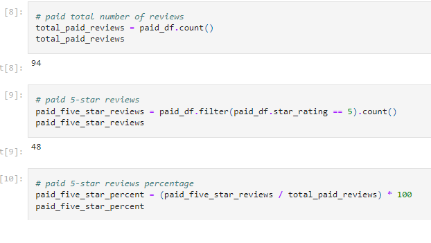
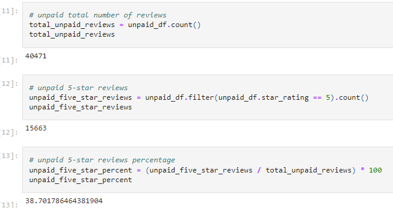

# Amazon_Vine_Analysis
## Overview
### The purpose of this analysis is to analyze Amazon reviews written by both paid and unpaid members of the Amazon Vine program, which allows businesses a way to recieve specalized sets of reviews that are seperate from the general reviews anyone can leave. We used PySpark to extract the data set, connected the data set to Amazon Web Services, and then loaded the data into pgAdmin. For this spesific exercise I looked at the reviews left in the video game industry since that piqued my curiosity as a former member of the industry.
## Results
### The critera we had for "meaningful" feedback left in these reviews was
### - More than 20 total votes
### - Percent of helpful votes > 50%
### This drastically reduced the total amount of data, leaving the most detailed and helpful reviews to give us the most accurate estimate for this study
### 
### 
### The total number of paid reviews was less than 1% of the total data pool, but around 50% of the paid reviews were given 5 stars.
## Summary
### 51% of the total reviews in the Vine program were 5 stars, where the non-sponsored reviews was around 39%. This trend shows a bias towards the vine program, since there is incentive to leave good reviews if a company is paying/sponsoring them. Further analysis that can be done could include looking at the other statistical information, such as the mean, median and mode of the star ratings for the paid and unpaid reviews
